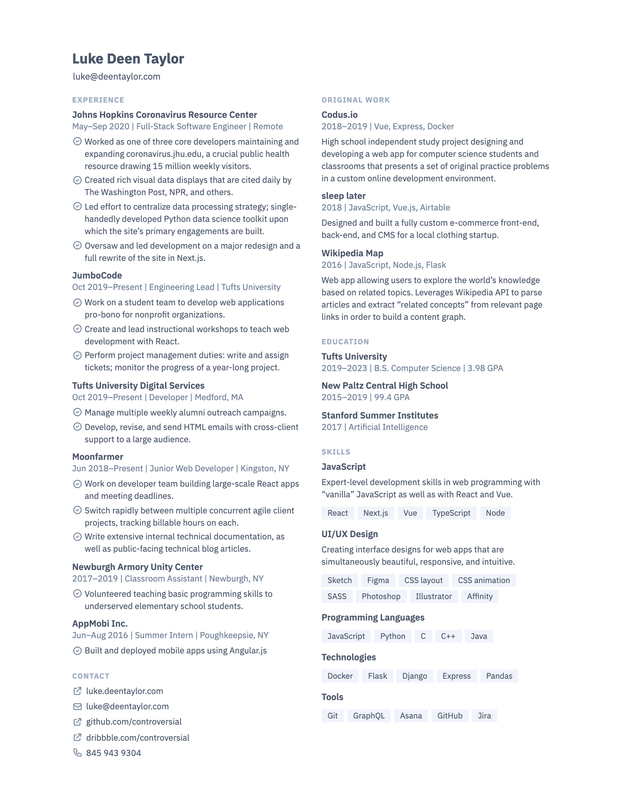

# Resume

My resumé. My own implementation, but mostly following a [design by WebPraktikos](https://github.com/WebPraktikos/universal-resume).

It’s implemented in HTML and CSS; I generate a PDF by printing.

The resumé is generated from structured content by a custom build system, which is mostly
Handlebars. This repository contains the code for the markup and styles, as well as that build
process, and unit tests for the more complex components.

## Preview

## Usage
### Setup
`npm install` should be all you need.

### Building
`npm run build` or `node build`

Start a “watch mode,” which will rebuild the site on file changes, using `npm run watch`.

### Running the tests
Just do `npm run test`
