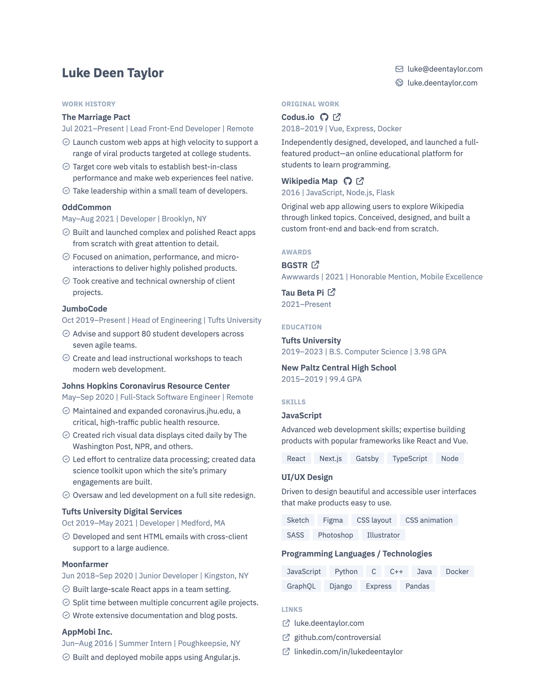

# Resume

A resumé for myself. The resumé is generated from structured content by a custom build system, which
(mostly Handlebars). This repository contains markup and styles as well as the code for that build
process.

It’s implemented in HTML and CSS; the PDF is generated by rendering the page in [Puppeteer](https://github.com/puppeteer/puppeteer).

## Preview

## Usage
### Setup
`npm install` should be all you need.

### Building
`npm run build` or `node build`

Start a “watch mode,” which will rebuild the site on file changes, using `npm run watch`.

### Running the tests
Just do `npm run test`

## Credits
While this is my own implementation entirely, it largely imitates a [design by WebPraktikos](https://github.com/WebPraktikos/universal-resume).

The document is set in [IBM Plex Sans](https://www.ibm.com/plex/). The icons are taken from [Heroicons](https://heroicons.com/).
